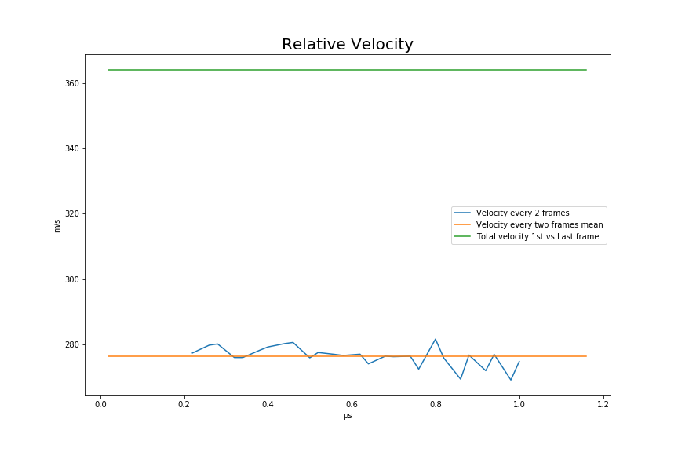
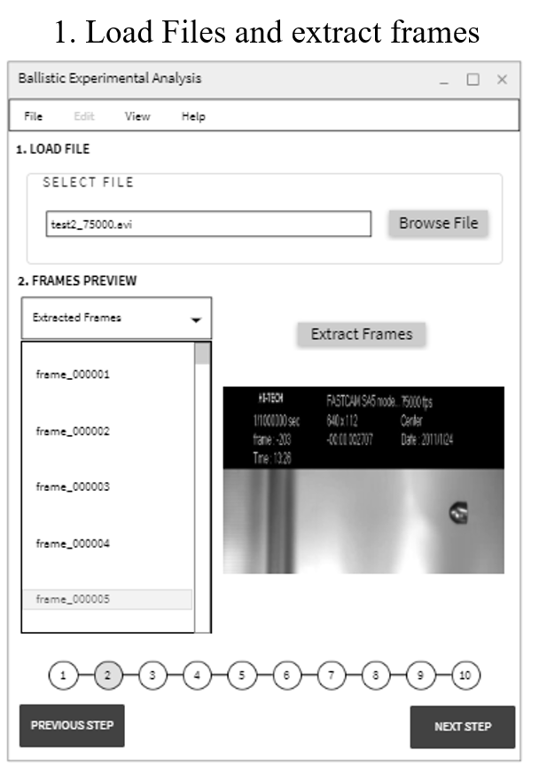
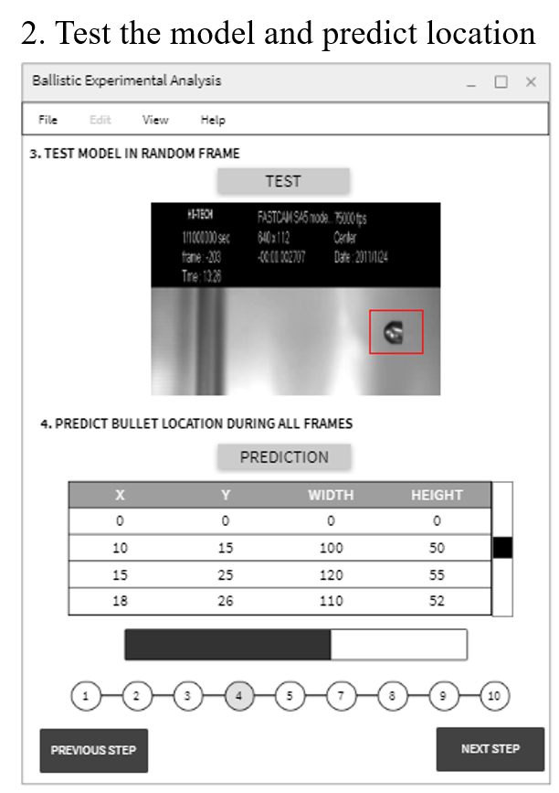
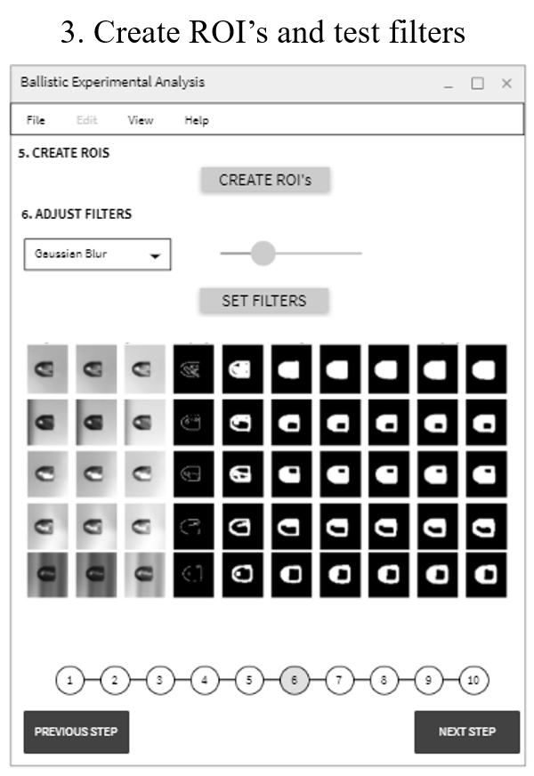
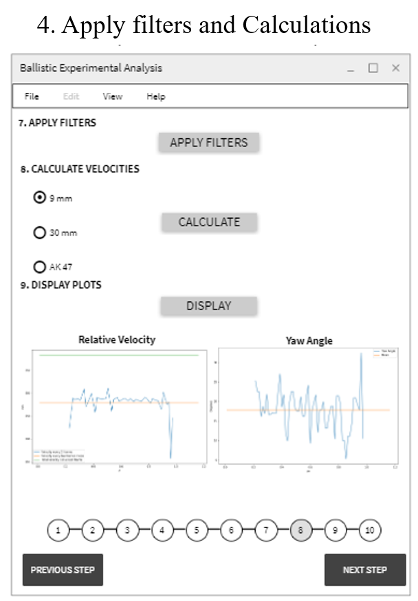
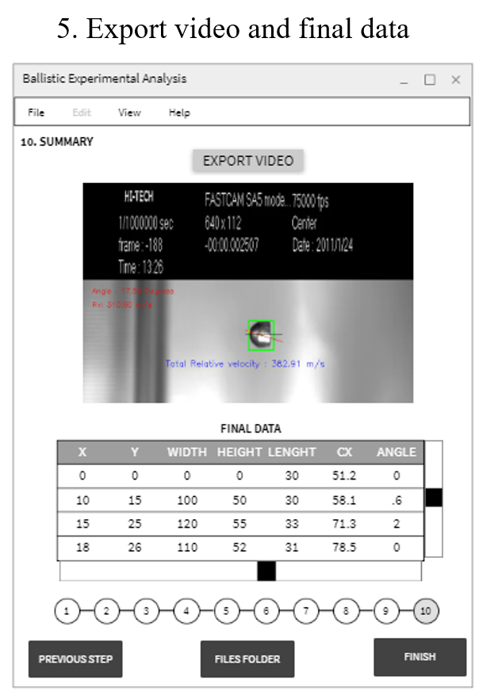

# Ballistic Experiment Analysis
This first stage of the code is developed in **Jupyter Notebooks**, due the flexibility and ease of management. The program uses a trained model to recognize and locate bullets through frames and further image analysis is done to extract location, inclination and derive velocities and angle. The aim of this program is to help the researchers in the areas of impact dynamics to do faster analysis.

* Checking MASK RCNN dependency
* Extracting Images from video
   * Testing the model in one image
* Predict Bullet Locations.
   * Creation of ROI Matrix (X,Y,HEIGHT,WIDTH) of each frame values.
* ROI Adjustment
   * Creation of Data_Analysis matrix.(Time,X,Y,W,H,L,Cx,Angle,Distance Traveled,Relative Velocity,Total Velocity)
* Filtering Images
  * Gaussian Blur
  * Bilateral Blur
  * Bright Correction
  * Canny Detection
  * Gradient 
  * Dilating
  * Clossing
  * Erosion
  * Smoothing
  * Threshoold
* Finding Contours, Centroid and Area
* Calculation of velocities
* Annotation of frames
* Video annotated creation
* Plotting Results

## SETUP FILES
* Clone or Download this repository.
* Creating Environment
The first recomended step is to create an environment for this application.The file with the dependencies is given as ''ballisticanalysis.txt''
Navigate to the main folder using the command prompt and to create the environment (in anaconda),use the following instruction:
  conda env create --file ballisticanalysis.txt
* Clone and Install MASK RCNN dependency
This application has dependencies in [MASK RCNN](https://github.com/matterport/Mask_RCNN) repository.Please go there and follow the steps to clon the repository and install the library.

## Deep Learning Object Detection for Ballistic Experimental Analysis
This application uses a pre-trained model to recognize bullets using **MASK RCNN**.  Even when the masking property of the algorithm is a good advantage to the application for this stage was not used, instead of that just the location (bounding box) prediction was implemented. Nevertheles, further improvements will include the masking technique, which was the main reason why MASK RCNN was the framework choosen.

## APPLICATION
The application create folders and save the files in each step to make easier the analysis and adjustments in the parameters.There, the files-tree follows the next arrangement.
* Project_Bullet
    * 1_Frames_Output
    * 2_Roi_Output
    * 3_Mask_Output
    * 4_Contours_Output
    * 5_Drew_Output
    * 6_Annotated
  * Annotated_video.mp4
  * data_analysis.csv
  * roi_matrix_predicted.csv
  * timing_analysis.csv
  * Relative velocity.png
  * Yaw Angle.png
### Video Output

### Plots

## FUTURE DEPLOYMENT

